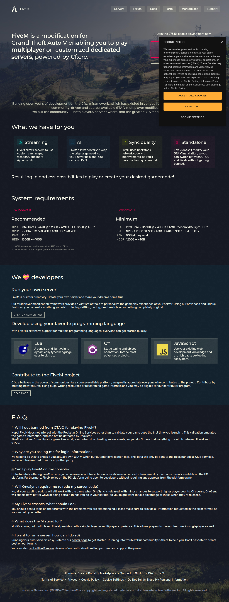

# Visited: https://fivem.net/
**Time:** Sat May 16 16:18:20 UTC 2026

## Screenshot

## Raw HTML
[page.html](./page.html)

## Downloaded Media (0 files)
_No media files downloaded_

## Other Links
- [#crashreport](#crashreport)
- [#cs](#cs)
- [#js](#js)
- [#logo](#logo)
- [#lua](#lua)
- [#m-is](#m-is)
- [#no-bans](#no-bans)
- [#onesync](#onesync)
- [#ownership](#ownership)
- [#playing-on-console](#playing-on-console)
- [#running-server](#running-server)
- [/](/)
- [/server-hosting](/server-hosting)
- [/server-hosting#contributor-program](/server-hosting#contributor-program)
- [/server-hosting#hosting-partners](/server-hosting#hosting-partners)
- [https://cdn.cookielaw.org/scripttemplates/otSDKStub.js](https://cdn.cookielaw.org/scripttemplates/otSDKStub.js)
- [https://discord.com/invite/fivem](https://discord.com/invite/fivem)
- [https://docs.fivem.net](https://docs.fivem.net)
- [https://docs.fivem.net/](https://docs.fivem.net/)
- [https://docs.fivem.net/scripting-manual/runtimes/csharp](https://docs.fivem.net/scripting-manual/runtimes/csharp)
- [https://docs.fivem.net/scripting-manual/runtimes/javascript](https://docs.fivem.net/scripting-manual/runtimes/javascript)
- [https://docs.fivem.net/scripting-manual/runtimes/lua](https://docs.fivem.net/scripting-manual/runtimes/lua)
- [https://fivem.net/terms](https://fivem.net/terms)
- [https://fonts.googleapis.com/css2?family=Montserrat:wght@500&family=Rubik:ital,wght@0,300;0,400;1,300;1,400](https://fonts.googleapis.com/css2?family=Montserrat:wght@500&family=Rubik:ital,wght@0,300;0,400;1,300;1,400)
- [https://fonts.googleapis.com/icon?family=Material+Icons+Outlined](https://fonts.googleapis.com/icon?family=Material+Icons+Outlined)
- [https://forum.cfx.re](https://forum.cfx.re)
- [https://forum.cfx.re/](https://forum.cfx.re/)
- [https://forum.cfx.re/t/new-error-bug-format/861](https://forum.cfx.re/t/new-error-bug-format/861)
- [https://github.com/citizenfx/fivem](https://github.com/citizenfx/fivem)
- [https://marketplace.cfx.re](https://marketplace.cfx.re)
- [https://portal.cfx.re](https://portal.cfx.re)
- [https://runtime.fivem.net/client/FiveM.exe](https://runtime.fivem.net/client/FiveM.exe)
- [https://servers.fivem.net/](https://servers.fivem.net/)
- [https://support.cfx.re](https://support.cfx.re)
- [https://www.googletagmanager.com/gtm.js?id=GTM-MQH9XXRZ](https://www.googletagmanager.com/gtm.js?id=GTM-MQH9XXRZ)
- [https://www.googletagmanager.com/ns.html?id=GTM-MQH9XXRZ](https://www.googletagmanager.com/ns.html?id=GTM-MQH9XXRZ)
- [https://www.rockstargames.com/ccpa](https://www.rockstargames.com/ccpa)
- [https://www.rockstargames.com/cookies](https://www.rockstargames.com/cookies)
- [https://www.rockstargames.com/privacy](https://www.rockstargames.com/privacy)
- [https://x.com/fivem](https://x.com/fivem)
- [index.204dddebe542e42a78e5.css](index.204dddebe542e42a78e5.css)
- [index.204dddebe542e42a78e5.js](index.204dddebe542e42a78e5.js)
- [javascript:void(0)](javascript:void(0))
- [javascript:void(0);](javascript:void(0);)

## Stats
- Links: 45
- Media: 0
